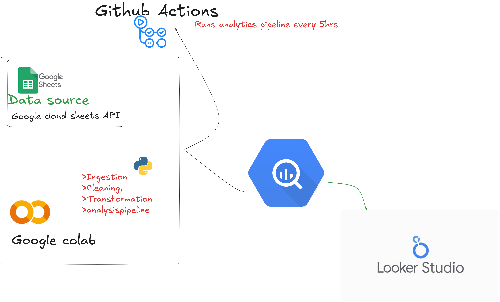

# Kwanza Tukule Study Case Analytics Pipeline

  

[](https://github.com/24jmwangi/KwanzaTukule/actions/workflows/colab_run.yml)

This repository contains the analytics pipeline for the **Kwanza Tukule** study case project. The pipeline is designed to ingest, clean, transform, and visualize data from Google Sheets using Google Colab and Looker Studio. The pipeline is automated using **GitHub Actions**, which runs every 5 hours.

---

## Table of Contents

1. [Overview](#overview)
2. [Architecture](#architecture)
3. [Notebook](#notebook)
4. [GitHub Actions Workflow](#github-actions-workflow)
5. [Installation](#installation)
6. [Usage](#usage)
7. [Contributing](#contributing)

---

## Overview

The **Kwanza Tukule Analytics Pipeline** automates the process of:
- **Data Ingestion**: Pulling data from Google Sheets using the Google Sheets API.
- **Data Cleaning and Transformation**: Processing the data in Google Colab.
- **Data Visualization**: Visualizing the transformed data in Looker Studio.

The pipeline is scheduled to run every 5 hours using GitHub Actions.

---

## Architecture

Below is the architecture of the analytics pipeline:



### Key Components:
1. **Data Source**: Google Sheets.
2. **Ingestion**: Data is pulled using the Google Sheets API.
3. **Cleaning and Transformation**: Performed in Google Colab.
4. **Visualization**: Data is visualized in Looker Studio.
5. **Automation**: GitHub Actions triggers the pipeline every 5 hours.

---

## Notebook

The core logic of the pipeline is implemented in the following Jupyter Notebook:

📒 [Kwanza Tukule Case Study Notebook](https://github.com/24jmwangi/KwanzaTukule/blob/main/KWANZA_TUKULE_CASE_STUDY.ipynb)

This notebook contains the code for data ingestion, cleaning, transformation, and preparation for visualization.

---

## GitHub Actions Workflow

The pipeline is automated using GitHub Actions. The workflow is defined in the following YAML file:

📄 [GitHub Actions Workflow](.github/workflows/colab_run.yml)

The workflow runs every 5 hours and executes the steps defined in the notebook.

---

## Installation

To set up this project locally, follow these steps:

1. Clone the repository:
   ```bash
   git clone https://github.com/24jmwangi/KwanzaTukule.git
   ```
2. Navigate to the project directory:
   ```bash
   cd KwanzaTukule
   ```
3. Install dependencies (if any):
   ```bash
   pip install -r requirements.txt
   ```
4. Open the notebook in Google Colab or Jupyter:
   ```bash
   jupyter notebook KWANZA_TUKULE_CASE_STUDY.ipynb
   ```

---

## Usage

To use the pipeline:
1. Ensure your Google Sheets API credentials are set up.
2. Update the notebook with your Google Sheet ID and range.
3. Run the notebook to ingest, clean, and transform the data.
4. Visualize the data in Looker Studio.

For automation, the GitHub Actions workflow will handle the execution every 5 hours.

---

## Contributing

Contributions are welcome! If you'd like to contribute, please follow these steps:

1. Fork the repository.
2. Create a new branch:
   ```bash
   git checkout -b feature/your-feature-name
   ```
3. Commit your changes:
   ```bash
   git commit -m "Add your commit message here"
   ```
4. Push to the branch:
   ```bash
   git push origin feature/your-feature-name
   ```
5. Open a pull request.

---

## License

This project is licensed under the MIT License. See the [LICENSE](LICENSE) file for details.

---
